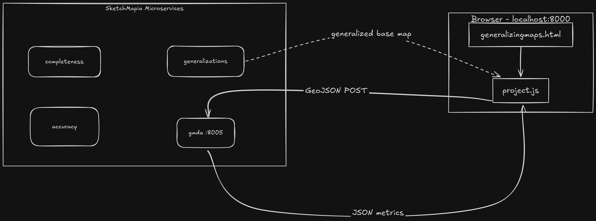
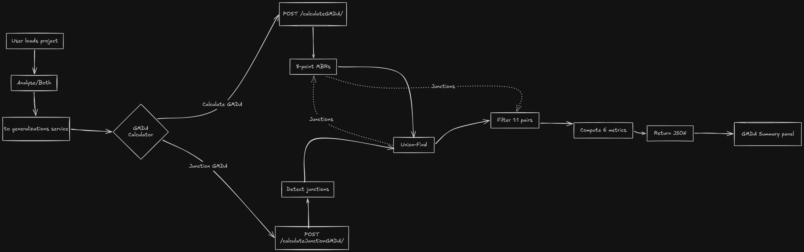

# Gardony Map Drawing Analyzer (GMDA) - SketchMapia Feature


<p align="center">
  
</p>

This repo is built directly on top of the [Sketchmapia Microservices](https://github.com/ifgi-sil/SketchMapia-Microservices) framework developed by the Spatial Intelligence Lab (SIL) at the Institute for Geoinformatics (IFGI) in University of Münster.


## Background
This feature was developed based on the foundational research presented in:

[Gardony Map Drawing Analyzer: Software for Quantitative Analyses of Sketch maps by Aaron L. Gardony, Holly A. Taylor, Tad T. Brunyé (2016)](https://link.springer.com/article/10.3758/s13428-014-0556-x)


## Architecture

The GMDA feature is added as an independent Django microservice that lives alongside the
existing SketchMapia services, all orchestrated through `docker-compose`.

<p align="center">
  
</p>


## Key Features

- **Geospatial Compatibility**:
Directly ingests GeoJSON feature collections representing landmarks.
- **Advanced Mode Support**:
Implements the paper's "Advanced Mode" by using 8 peripheral points along the MBR of each landmark instead of the "Basic Mode", which uses a Single Centroid. This accurately captures both the position and the spatial extent/orientation of the drawn landmarks or objects.
- **Robust Angular Math**:
It uses the trigonometric summation (np.arctan2) to accurately calculate circular means, gracefully handling the $0^\circ \equiv 360^\circ$ wrap-around.
- **Strict 1-to-1 Alignment**:
Utilizes a Union-Find structure via a "SketchAlign" attribute to group features, filtering for strict 1-to-1 matches to prevent severe distortion of metrics.


## Combinatorics (Advanced Mode)

Since this method represents each landmark using 8 peripheral points, it generates a massive number of pairwise comparisons. To prevent the peripheral points belonging to the same landmark from being compared to one another, the total number of valid comparisons is strictly calculated.

Let $n_{TL}$ be the number of total target landmarks, and $n_{DL}$ be the number of drawn sketch landmarks. The total number of pairwise comparisons ($N$) is defined as:

For Total Target Landmarks ($N_{TL}$):

$$N_{TL} = \binom{8n_{TL}}{2} - n_{TL}\binom{8}{2}$$

For Drawn Landmarks ($N_{DL}$):

$$N_{DL} = \binom{8n_{DL}}{2} - n_{DL}\binom{8}{2}$$


## Metrics Calculated

This service outputs a dictionary containing the following core spatial metrics:

| Metric | Measures | Penalizes omissions? |
| :--- | :--- | :---: |
| **CanOrg** | Topological organization (N/S/E/W) | ✅ Yes ($N_{TL}$) |
| **CanAcc** | Spatial layout accuracy | ❌ No ($N_{DL}$) |
| **DistAcc** | Distance error magnitude | ❌ No |
| **ScaBias** | Expansion (+) / compression (−) | — |
| **AngAcc** | Angular deviation accuracy | ❌ No |
| **RotBias** | Systematic rotation (CW + / CCW −) | — |

1. **Canonical Organization (CanOrg)**:
Measures the overall spatial organization and topological accuracy (N/S/E/W relationships). It uses the total possible landmark pairs ($N_{TL}$) as the denominator, intentionally penalizing the score for any omitted/forgotten landmarks.

$$CanOrg = \frac{\sum_{i=1}^{N_{TL}} \text{CanonicalScore}_i}{2N_{TL}}$$

2. **Canonical Accuracy (CanAcc)**:
Isolates the accuracy of the spatial layout from recall completeness. It switches the denominator to the drawn landmark pairs ($N_{DL}$), meaning it does not penalize the user for missing landmarks, only for the placement of the landmarks they did draw.

$$CanAcc = \frac{\sum_{i=1}^{N_{DL}} \text{CanonicalScore}_i}{2N_{DL}}$$

3. **Distance Accuracy (DistAcc)**:
Calculates the magnitude of distance error between landmark pairs, scale-equalized and normalized to a score between 0 and 1. Let $dr_{SM}$ and $dr_{TE}$ be the distance ratios (distance divided by max distance) for the sketch map and target environment, respectively.

$$DistAcc = 1 - \frac{\sum_{i=1}^{N_{DL}} |dr_{SM, i} - dr_{TE, i}|}{N_{DL}}$$


4. **Scaling Bias (ScaBias)**:
Tracks the directional expansion or compression of the map by evaluating scale-equalized distance ratios. Positive values indicate expansion, while negative values indicate compression.

$$ScaBias = \frac{\sum_{i=1}^{N_{DL}} (dr_{SM, i} - dr_{TE, i})}{N_{DL}}$$

5. **Angular Accuracy (AngAcc)**:
Averages the absolute angular deviations ($ang_{Diff}$) between target and drawn landmark pairs. It scales the errors against the maximum possible error ($180^\circ$) to produce a normalized score between 0 and 1.

$$AngAcc = 1 - \frac{\sum_{i=1}^{N_{DL}} \left| \frac{180}{\pi} ang_{Diff, i} \right|}{180 \cdot N_{DL}}$$


6. **Rotational Bias (RotBias)**:
Computes the circular mean of angular differences to identify systematic rotational skewing of the entire drawn map compared to the reference. Positive values indicate clockwise rotation, and negative indicate counterclockwise.

$$RotBias = \frac{180}{\pi} \text{atan2}\left( \frac{\sum_{i=1}^{N_{DL}} \sin(ang_{Diff, i})}{N_{DL}}, \frac{\sum_{i=1}^{N_{DL}} \cos(ang_{Diff, i})}{N_{DL}} \right)$$


## Data Flow

The end-to-end flow from loading a project to viewing the GMDA metrics:

<p align="center">
  
</p>

### Request Lifecycle

<p align="center">
  
</p>


## New Features Added

1. **GMDA Calculator (Landmark Based)**:

Calculates the six GMDA metrics using polygon features (landmarks such as buildings) from the generalized basemap and sketchmap.

**How it works?**
- After running **Analyse**, the generalized base map and processed sketchmap are available in the frontend.
- Clicking the button sends both the maps as GeoJSON to the **gmda** microservice via a **POST** request to **/gmda/calculateGMDA**
- The backend extracts all polygon features from both maps, builds 8-point MBRs for each, resolves alignment using the **SketchAlign** property, and classifies pairs into 1:1, Many:1, and Many:Many groups using Union-Find.
- The six metrics are computed over all valid landmark pairs and returned as JSON.
- Results are then displayed in the GMDA summary panel.

2. **Junction based GMDA Calculator**:

Calculates the six GMDA metrics using street junction points -- the intersections of road segments -- from both maps.

<p align="center">
  
</p>

**How it works?**
- After running **Analyse**, clicking the button sends both maps as **GeoJSON** to **/gmda/calculateJunctionGMDA**
- The backend detects junctions by finding road endpoints that share the same coordinate (rounded to 3 decimal places) across two or more line segments.
- For the basemap, all junctions are considered for **nTL** (total landmarks). For the sketchmap, only junctions formed by road IDs shared with the base maps are used.
- Junctions are matched between maps using a **topological subset check**: a sketch junction matches a base junction if all road IDs at the sketch junction are a subset of the road IDs at the base junction.
- Matched pairs are classified using the same Union-Find grouping as landmarks, and the six metrics are computed and returned.


## New Microservice: **gmda**

A new Django microservice was added following the same architecture as the existing services (**completeness, accuracy, generalizations**).

```text
gmda/
├── Dockerfile                  # runs on port 8005
├── requirements.txt            # Django, numpy, shapely
├── manage.py
├── gmda/
│   ├── settings.py
│   ├── urls.py                 # routes /gmda/ to microservice/urls.py
│   ├── wsgi.py
│   └── asgi.py
└── microservice/
    ├── urls.py                 # maps endpoints to views
    └── views.py                # all GMDA logic lives here
```

### Endpoints

| Endpoint | Method | Description |
| :--- | :---: | :--- |
| `/gmda/calculateGMDA/` | **POST** | Landmark-based GMDA |
| `/gmda/calculateJunctionGMDA/` | **POST** | Junction-based GMDA |

### Request Format (Both Endpoints)

```text
POST /gmda/calculateGMDA/
Content-Type: application/x-www-form-urlencoded

basemapdata=[GeoJSON string]&sketchmapdata=[GeoJSON string]
```

### Response Format

```json
{
  "CanOrg": 0.0962,
  "CanAcc": 0.8917,
  "ScaBias": -0.0001,
  "DistAcc": 0.9358,
  "RotBias": -30.2334,
  "AngAcc": 0.7942,
  "nTL": 14,
  "nDL": 5
}
```

---

## Changes to Existing Files

| File | Change |
| :--- | :--- |
| `docker-compose.yml` | Added `gmda` service on port 8005. |
| `sketchmap_analyser/static/js/project.js` | Added `gmda: 8005` to port map; added `computeGMDAFromAllGenBaseMap()` and `computeJunctionGMDAFromAllGenBaseMap()` handler functions. |
| `sketchmap_analyser/templates/generalizingmaps.html` | Added "Calculate GMDA" and "Calculate Junction GMDA" menu items under the GMDA Calculator menu. |
| `generalizations/generalizations/settings.py` | Fixed CORS configuration. |

---

## Usage

1. **Start all services:**
   ```bash
   docker-compose up --build
   ```
2. Open `http://localhost:8000/generalizingmaps/` in your browser.
3. Load a project and click **Analyse** → **Both**.
4. Once the analysis completes, click **GMDA Calculator** → **Calculate GMDA** for landmark metrics, or **GMDA Calculator** → **Calculate Junction GMDA** for junction metrics.
5. Results will appear in the **GMDA Summary** panel and can be downloaded as a CSV.

> ⚠️ **Note:** The `Analyse` step must be run before using the GMDA Calculator. The GMDA calculation strictly depends on the generalized base maps produced by the initial analysis.

---

## Contributors

A massive thank you to everyone who helped build the GMDA Calculator!

- Clement Amirault [CL-77](https://github.com/CL-77)
- Ajay [ajay-sheokand](https://github.com/ajay-sheokand)